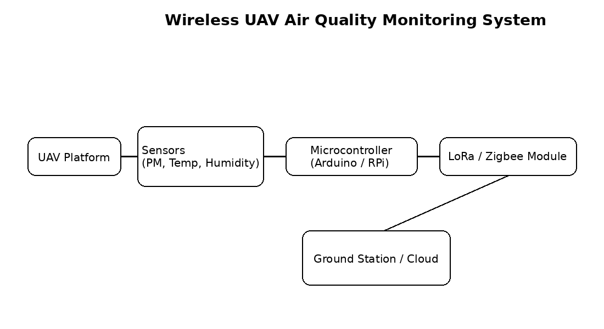
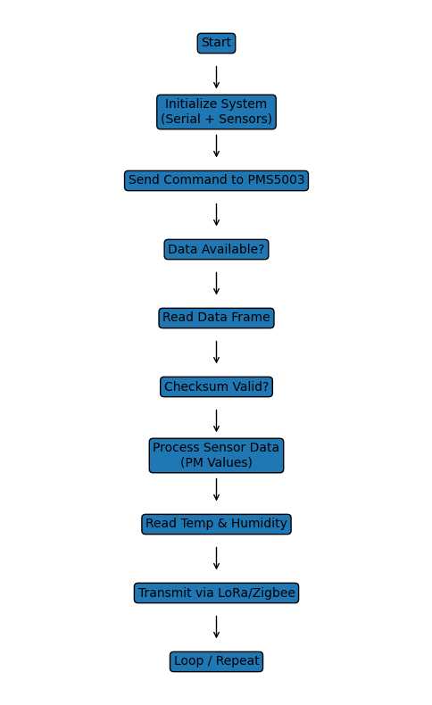
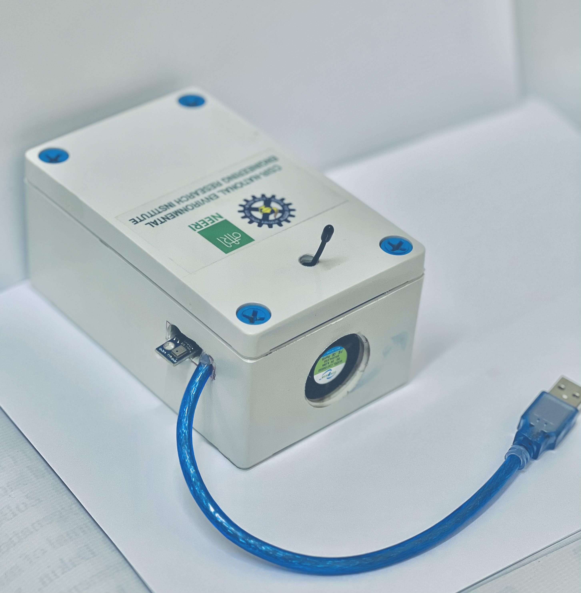
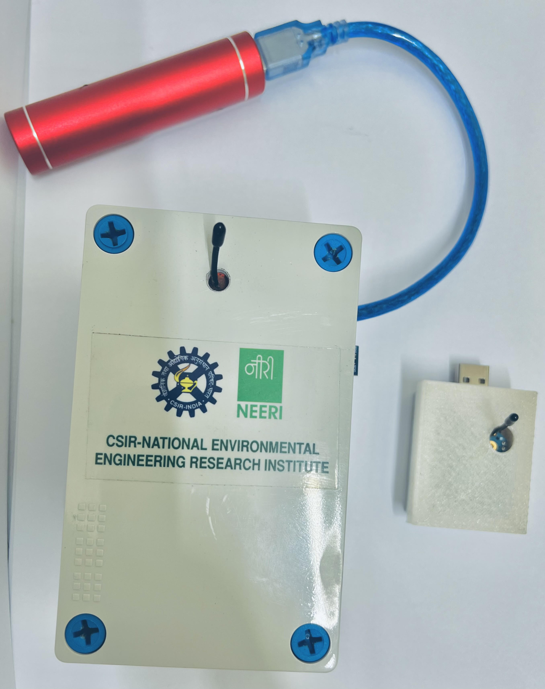
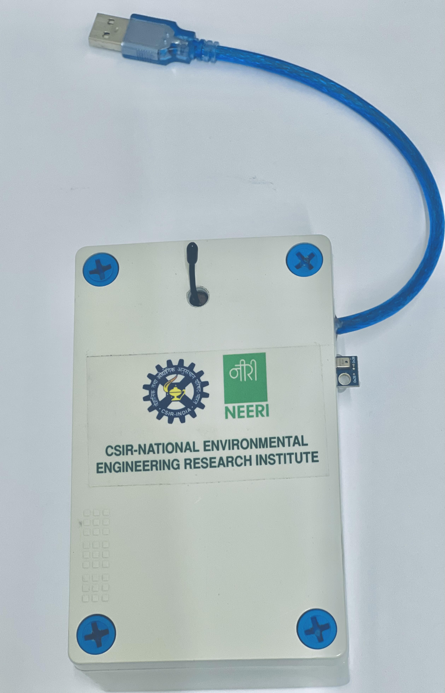
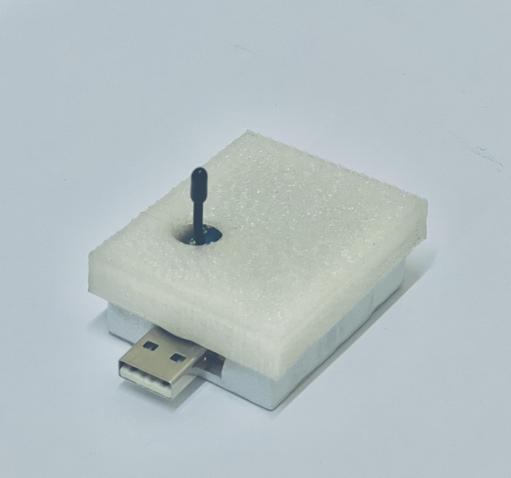

# UAV Air Quality Monitoring System (LoRa/Zigbee)

Embedded IoT system for real-time environmental monitoring with wireless data transmission using LoRa/Zigbee.

---

## Overview

This project implements a wireless air quality monitoring system designed for UAV-based and remote deployments. It integrates particulate matter sensing with environmental parameters and transmits the data over LoRa/Zigbee for remote monitoring.

The system measures:

* PM1.0, PM2.5, PM10 (PMS5003)
* Temperature and Humidity (AHT10)

---

## Key Features

* PMS5003 air quality sensing (PM1.0, PM2.5, PM10)
* Temperature & humidity sensing using AHT10
* Wireless communication via LoRa / Zigbee (UART-based)
* Custom serial protocol implementation for PMS5003 sensor
* Real-time environmental data acquisition and transmission
* Designed for UAV-based and distributed sensing systems

---

## System Architecture

---

## System Flowchart

---

## Hardware Components

* Arduino (Uno/Nano)
* PMS5003 Air Quality Sensor
* AHT10 Temperature & Humidity Sensor
* LoRa / Zigbee Module

---

## Hardware Connections

* PMS5003 → UART (SoftwareSerial: pins 2, 3)
* AHT10 → I2C interface
* LoRa/Zigbee Module → UART
* Microcontroller → Arduino

---

## Software Overview

The system performs the following operations:

1. Initializes sensors and serial communication
2. Sends command to PMS5003 sensor
3. Reads and validates 32-byte data frame using checksum
4. Extracts particulate matter values
5. Reads temperature and humidity from AHT10
6. Formats data into structured output
7. Transmits data via LoRa/Zigbee
8. Repeats the process in a loop

---

## Libraries Used

* Adafruit_AHTX0
* SoftwareSerial

---

## How to Run

1. Connect hardware components as per the configuration
2. Install required libraries in Arduino IDE:

   * Adafruit_AHTX0
   * SoftwareSerial
3. Upload the code to the Arduino board
4. Open Serial Monitor at 9600 baud rate
5. Observe real-time sensor data output

---

## Results

* Successfully measured PM1.0, PM2.5, PM10 in real-time
* Reliable wireless communication achieved using LoRa/Zigbee
* System validated through real-time data acquisition and transmission

---

## Future Improvements

* Cloud integration (MQTT / AWS / ThingsBoard)
* Data visualization dashboard
* Power optimization for long-term deployment

---

## Hardware Setup

Actual sensor and communication setup used for data acquisition and wireless transmission.

  
  

  
  

---

## Note

This repository contains a simplified and non-confidential representation of work carried out during my time at CSIR–NEERI.
